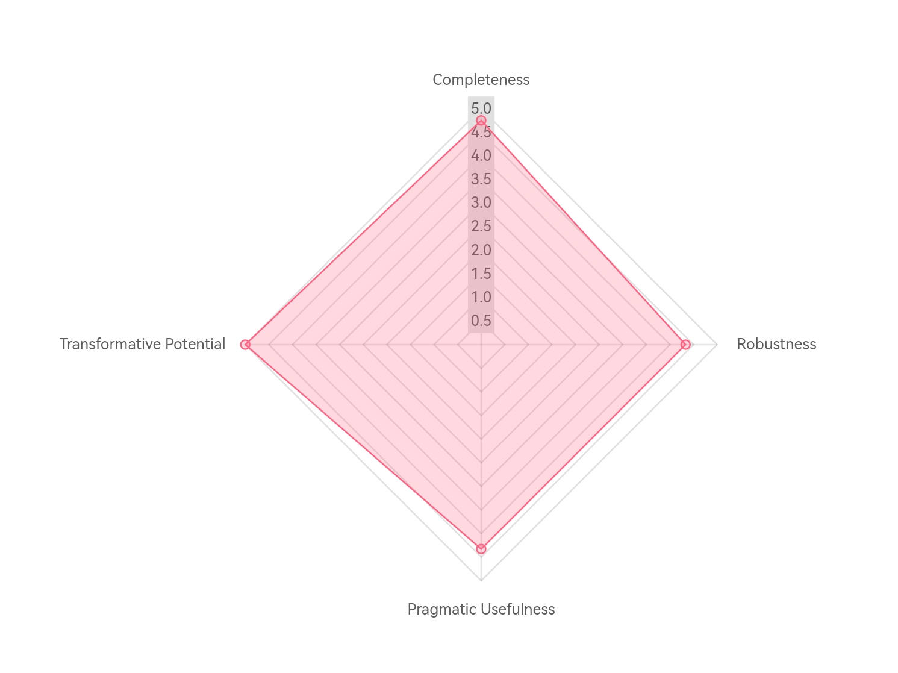

# OMAF Case Study:
## Existence as a Conference of Difference

by ChatGPT 5 and John Mackay (john@johnmackay.net)

### 1. Abstract
This ontology proposes that existence is fundamentally grounded in the **Conference of Difference** — a process in which irreducible differences interact, adapt, and co-create reality. Unlike models that emphasize static substances or linear causation, the Conference of Difference views reality as an evolving, co-petitive interplay in which beings adapt together rather than compete exclusively against one another.

Applying the **Ontological Model Assessment Framework (OMAF)** to this thesis provides a structured evaluation of its completeness, robustness, pragmatic usefulness, and transformative potential. The aim is to demonstrate that philosophical ontologies can be articulated and assessed with the same clarity and replicability expected in other disciplines.
### 2. Introduction
Philosophy often advances ontological models in a narrative or argumentative style, leaving them difficult to compare or evaluate systematically. The OMAF approach addresses this gap by creating a structured methodology to assess any ontology — whether it concerns love, knowledge, governance, or existence itself.

This case study serves two purposes:
1. To explicate *Existence as a Conference of Difference* in a clear, structured, and replicable format.
2. To demonstrate OMAF’s capacity to evaluate such a model across multiple dimensions, thereby setting a precedent for systematic ontology assessment.
### 3. Ontology Overview
#### 3.1. What grounds the domain?
The domain of existence is grounded in the **irreducibility of difference** — the principle that diversity of being is not derivative but primary. These differences are not obstacles to be overcome but the very foundation of reality, giving rise to the capacity for adaptation, reciprocity, and co-creation.
#### 3.2. How does the domain manifest?
Existence manifests as a dynamic conference: beings continually interact, exchanging power (ability) in ways that seek equilibrium through mutual adaptation. These interactions may be cooperative, competitive, or co-petitive, but they always occur within a shared relational field.
#### 3.3. Why does the domain persist?
The domain persists because difference generates both unease (dukkha) and opportunity. Unease compels beings to adapt; adaptation requires interaction; interaction regenerates difference. This cycle ensures the ongoing vitality and evolution of existence.
#### 3.4. Boundaries of the domain
The Conference of Difference applies universally — across physical, biological, social, and conceptual domains. While it has no hard boundaries in scope, its explanatory utility is bounded by its ability to account for observed phenomena through the lens of irreducible difference and reciprocal adaptation.
### 4. OMAF Application & Scoring

| Dimension              | Criteria                                      | Score (1–5) | Notes |
|------------------------|-----------------------------------------------|-------------|-------|
| **Completeness**       | What grounds the domain?                      | 5           | Clearly articulated as irreducible difference. |
|                        | How does the domain manifest?                 | 5           | Manifestation explained via dynamic co-petition and adaptation. |
|                        | Why does the domain persist?                  | 5           | Persists through cyclical regeneration of difference. |
|                        | Boundaries clearly defined?                   | 4           | Universality makes strict boundaries difficult, but conceptual boundaries clear. |
| **Robustness**         | Internal coherence                            | 5           | No major contradictions; integrates grounding, manifestation, persistence. |
|                        | External validity across contexts             | 4           | Strong applicability; empirical grounding limited by metaphysical scope. |
|                        | Objectivity                                   | 4           | Minimizes subjective bias via structural principles. |
| **Pragmatic Usefulness**| Explanatory power                             | 5           | Explains diverse phenomena across domains. |
|                        | Predictive potential                          | 3           | Offers directional rather than precise predictive capacity. |
|                        | Applicability                                 | 5           | Readily applied to philosophical, social, and governance models. |
| **Transformative Potential** | Potential to change thinking/practice    | 5           | Encourages a shift from competition to co-petition. |
|                        | Potential to generate new inquiry             | 5           | Opens multiple lines of philosophical and applied research. |

**Average Scores:**
- Completeness: **4.75**
- Robustness: **4.33**
- Pragmatic Usefulness: **4.33**
- Transformative Potential: **5.00**

#### Radar Summary

### 5. Discussion
The evaluation reveals an ontology that is conceptually strong, widely applicable, and potentially transformative. Its grounding in irreducible difference avoids the pitfalls of monism without fragmenting into relativism. The model bridges metaphysics and praxis, making it relevant not only to philosophical discourse but also to applied fields such as governance (e.g., Colocracy) and conflict resolution.

The one notable limitation is its predictive specificity. While it can forecast broad patterns (e.g., adaptation cycles), it does not yield precise quantitative predictions — a limitation inherent to many metaphysical frameworks.

The boundary issue is also worth noting: universality strengthens its scope but makes hard demarcation challenging. However, the model compensates by providing conceptual boundaries tied to its central principle.
### 6. Conclusion
The OMAF evaluation of *Existence as a Conference of Difference* demonstrates that a metaphysical model can be articulated and assessed with the same clarity, transparency, and replicability expected in other fields of inquiry. By explicitly addressing **what** grounds the ontology, **how** it manifests, and **why** it persists — and then scoring its completeness, robustness, pragmatic usefulness, and transformative potential — we have produced a **structured, evidence-based portrait** of its strengths and areas for refinement.

This case study confirms that:
1. The model offers a coherent, adaptable, and generative account of existence grounded in irreducible difference.
2. Its universal scope does not preclude meaningful boundaries, and these boundaries can be tested and refined.
3. It is both conceptually rigorous and practically applicable, with a capacity to inform thinking and practice across domains from philosophy to governance.

By embedding the evaluation within OMAF, we have also shown that ontological work — often perceived as abstract, subjective, or idiosyncratic — can be made **systematically comparable**. Others can now apply OMAF to their own ontologies, building a shared language for critique, validation, and iterative improvement.

Ultimately, the Conference of Difference is not just a philosophical position but an **invitation** — to engage, adapt, and co-create. The framework’s enduring strength lies in its openness to further dialogue, making it a living model rather than a fixed doctrine.

